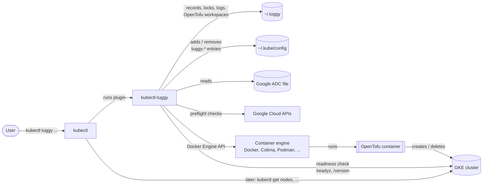
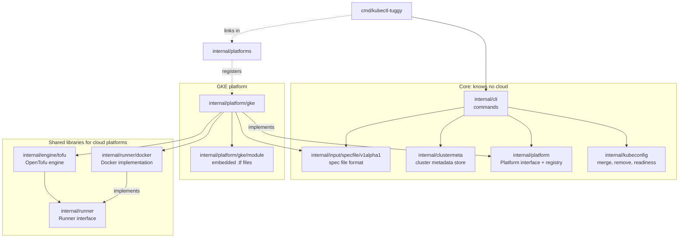
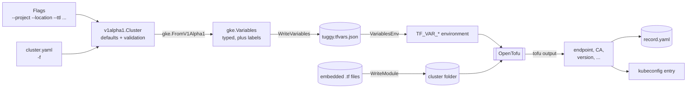
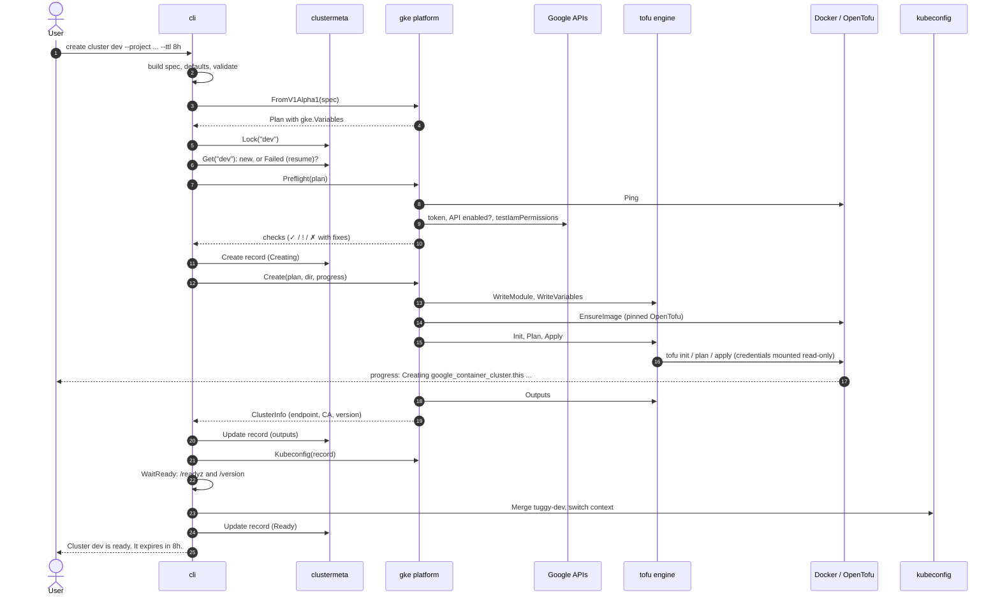
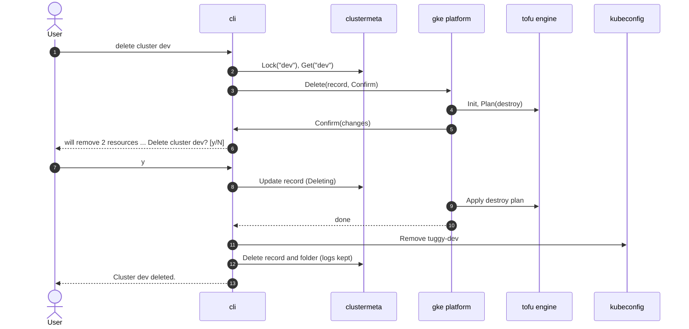
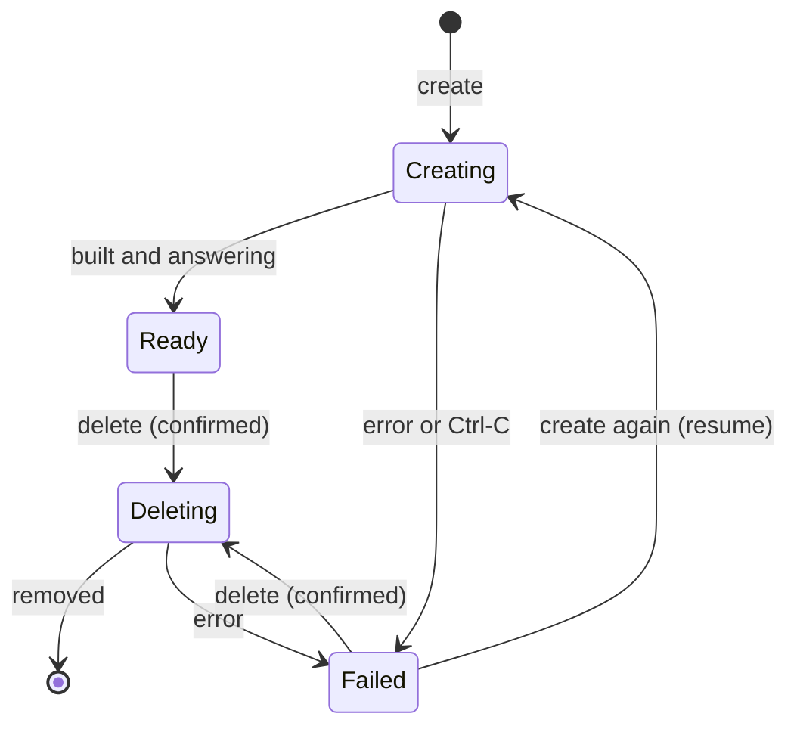
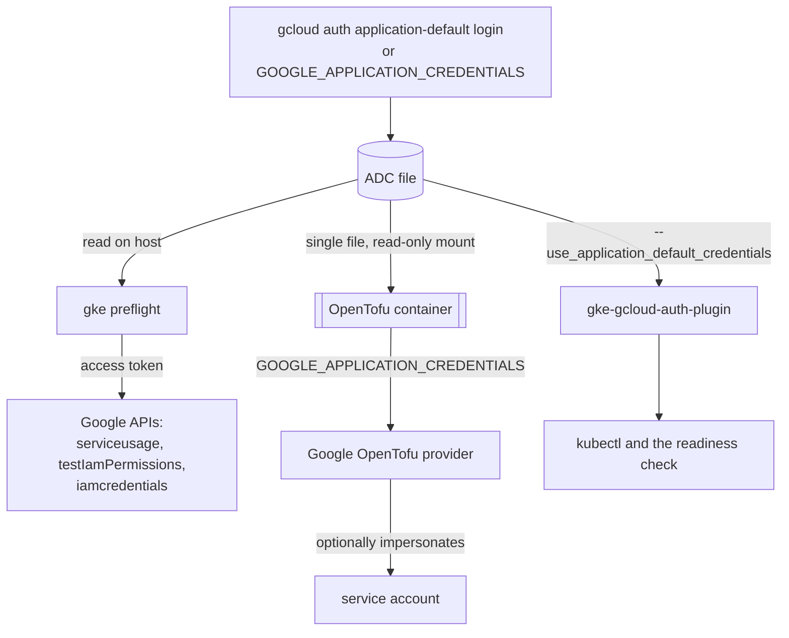

# tuggy architecture

This document describes how `kubectl tuggy` is built today: its parts, how they fit together, and how a request flows through them. For *why* it is built this way, and for the decisions still open, see [design 0001](design/0001-architecture.md). For what comes next, see the [implementation plan](implementation-plan.md).

**Status:** phase 1 (GKE) in progress. Built: spec file format, cluster metadata store, platform interface, container runner, OpenTofu engine, GKE module and platform, kubeconfig handling, and the commands. Still to come in phase 1: end-to-end tests, quickstart docs and the release pipeline.

## Contents

1. [What tuggy does](#1-what-tuggy-does)
2. [System context](#2-system-context)
3. [Components](#3-components)
4. [Interfaces](#4-interfaces)
5. [Data flow: from flags to a cluster](#5-data-flow-from-flags-to-a-cluster)
6. [Creating a cluster](#6-creating-a-cluster)
7. [Deleting a cluster](#7-deleting-a-cluster)
8. [Cluster lifecycle](#8-cluster-lifecycle)
9. [Credentials](#9-credentials)
10. [Files on disk](#10-files-on-disk)
11. [Running OpenTofu in a container](#11-running-opentofu-in-a-container)
12. [Errors and exit codes](#12-errors-and-exit-codes)
13. [Testing](#13-testing)
14. [Adding a platform](#14-adding-a-platform)
15. [Key decisions](#15-key-decisions)

---

## 1. What tuggy does

`kubectl tuggy` is a kubectl plugin that creates, lists, describes and deletes Kubernetes clusters with one command:

```sh
kubectl tuggy doctor --platform gke --project my-project
kubectl tuggy create cluster dev --platform gke --project my-project --location us-central1-a --ttl 8h
kubectl tuggy get clusters
kubectl tuggy delete cluster dev
```

For cloud platforms it runs [OpenTofu](https://opentofu.org/) modules that are built into the binary, in a container, so users need only `kubectl`, a Docker-compatible engine and their cloud sign-in.

## 2. System context



| External system | What tuggy uses it for |
|---|---|
| kubectl | Finds and runs `kubectl-tuggy` as a plugin. Later talks to the cluster through the kubeconfig entry tuggy writes. |
| Container engine | Runs OpenTofu. Any engine speaking the Docker Engine API, found the way the `docker` CLI finds it. |
| OpenTofu image | Official `ghcr.io/opentofu/opentofu`, pinned by digest. |
| Google Cloud APIs | Preflight only: access token, Kubernetes Engine API state, permission check, service-account impersonation. |
| Google ADC file | The user's sign-in, from `gcloud auth application-default login` or a key file. |
| `~/.kube/config` | Where tuggy adds the new cluster, through client-go like `kubectl config`. |

## 3. Components



The core never imports a platform. `internal/platforms` is the only file that changes when a platform is added.

| Package | Responsibility | Key types |
|---|---|---|
| `cmd/kubectl-tuggy` | Entry point. Handles Ctrl-C and SIGTERM through the context and links in the built-in platforms. | `main` |
| `internal/cli` | All commands, flags, prompts, progress display and output formats. Built around `App`, which holds every dependency so commands can be tested with fakes. | `App`, `Run`, exit codes |
| `internal/input/specfile/v1alpha1` | The spec file format (`tuggy.dev/v1alpha1`, `kind: Cluster`) and its strict loading, defaults and validation. Flags fill the same type. An input format only: nothing after the platform's translation depends on it. | `Cluster`, `ClusterSpec`, `NodePool`, `Duration` |
| `internal/clustermeta` | The cluster metadata store: one record per cluster with tuggy's own facts, each cluster's folder, per-cluster locks, and logs. Does not hold OpenTofu state or platform files. | `Store`, `Local`, `Record`, `Status` |
| `internal/platform` | The `Platform` interface every platform implements, shared types, and the registry. | `Platform`, `FlagBinder`, `Plan`, `ClusterInfo`, `CheckResult`, `Registry` |
| `internal/platform/gke` | Google Kubernetes Engine: GKE settings, translation to typed module variables, credential discovery, preflight checks, create, delete, describe, kubeconfig. | `Platform`, `Config`, `Variables`, `Credentials` |
| `internal/platform/gke/module` | The GKE OpenTofu module (`.tf` files and provider lock file), embedded with `go:embed`. | `FS` |
| `internal/engine/tofu` | Runs OpenTofu for any cloud platform: writes the module and variables, runs `init`, `plan`, `apply` and `output`, turns OpenTofu's JSON output into progress events and readable errors. | `Engine`, `Workspace`, `PlanResult`, `Event`, `Error` |
| `internal/runner` | Runs one command in a container and reports how it ended. | `Runner`, `Spec`, `Mount` |
| `internal/runner/docker` | `Runner` over the Docker Engine API, with engine discovery like the `docker` CLI. | `Docker`, `Endpoint` |
| `internal/kubeconfig` | Adds and removes `tuggy-*` kubeconfig entries through client-go, and waits for a new cluster to answer. | `Manager`, `WaitReady` |
| `internal/version` | Build information shown by `version`. | `Info` |
| `…/platformtest`, `…/runnertest` | Fakes for tests. | `Fake` |

## 4. Interfaces

Three interfaces separate what varies from what stays fixed.

### Platform

How the CLI talks to anything that builds clusters. GKE implements it today; bare metal comes next.

```go
type Platform interface {
    Name() string
    FromV1Alpha1(c *v1alpha1.Cluster) (*Plan, error)              // spec → typed variables
    Preflight(ctx context.Context, p *Plan) []CheckResult          // used by create and doctor
    Create(ctx context.Context, p *Plan, opts CreateOptions) (*ClusterInfo, error)
    Delete(ctx context.Context, rec *clustermeta.Record, opts DeleteOptions) error
    Describe(ctx context.Context, rec *clustermeta.Record, dir string) (*ClusterInfo, error)
    Kubeconfig(ctx context.Context, rec *clustermeta.Record) (*clientcmdapi.Config, error)
    ListRemote(ctx context.Context, opts ListOptions) ([]ClusterInfo, error)
}
```

- `CreateOptions` and `DeleteOptions` carry the cluster's folder, the shared cache folder, `DryRun`, a log writer and an `OnProgress` callback.
- `DeleteOptions.Confirm` is called with the planned removals before anything is removed, so the CLI can ask the user.
- Platforms that take their own flags (`--project`, `--location`, …) also implement `FlagBinder`. Those flags fill `spec.platformConfig`, so flags and spec files take the same path.
- Platforms register themselves from `init()`; the CLI looks them up by name.

### Store

How the CLI keeps track of clusters between commands. `Local` keeps everything under `~/.tuggy`; a shared store (GCS, S3) can be added for teams later.

```go
type Store interface {
    Get(name string) (*Record, error)
    List() ([]*Record, error)
    Create(r *Record) error
    Update(r *Record) error
    Delete(name string) error          // only once the cluster is Deleting; keeps logs
    Dir(name string) string            // the cluster's folder, where the platform keeps its files
    Lock(name string) (unlock func() error, err error)
}
```

### Runner

How cloud platforms run OpenTofu. The Docker implementation works with any Docker-compatible engine; a local `tofu` binary could be added later.

```go
type Runner interface {
    Ping(ctx context.Context) error
    EnsureImage(ctx context.Context, image string, progress io.Writer) error
    Run(ctx context.Context, spec Spec) (exitCode int, err error)
}
```

`Run` returns the command's exit code. The error is non-nil only if the container couldn't run or was cancelled, so "OpenTofu failed" and "Docker failed" are never confused.

## 5. Data flow: from flags to a cluster



1. **Input.** Flags and `-f` files produce the same `v1alpha1.Cluster`. The core validates fields every platform understands: name, TTL and node pools. The GKE part sits under `spec.platformConfig`.
2. **Translation.** The GKE platform decodes `platformConfig` strictly and builds `gke.Variables`, a Go struct that mirrors the module's `variables.tf` exactly. A contract test keeps the two in sync. Labels such as `managed-by=tuggy` and the expiry time are added here.
3. **Workspace.** The engine copies the embedded module into the cluster's folder (only on the first create, so a cluster keeps the module it was built with) and writes the variables to `tuggy.tfvars.json`, the single record of what was asked for.
4. **OpenTofu.** The engine reads `tuggy.tfvars.json` on the host and passes each value as a `TF_VAR_<name>` environment variable: strings as they are, everything else as compact JSON.
5. **Results.** `tofu output -json` gives the endpoint, CA certificate and Kubernetes version. They are saved in `record.yaml` and used to build the kubeconfig entry.

An example of step 2, for a full spec, is in [`internal/platform/gke/testdata/variables-full.json`](../internal/platform/gke/testdata/variables-full.json).

## 6. Creating a cluster



- **Nothing is built if a check fails.** A failed preflight exits with code 3 before anything is recorded.
- **The record is written before building**, so an interruption is visible. A failure or Ctrl-C marks it `Failed` with the reason. Running the same command again resumes: OpenTofu applies only what is missing.
- **"Ready" means the cluster answered**, not just that OpenTofu finished.
- **`--dry-run`** runs the checks and the plan in a throwaway folder and prints the planned changes, without recording anything.

## 7. Deleting a cluster



- **Only the named cluster can be affected**, because each cluster has its own OpenTofu state.
- **Declining, or having no terminal without `--yes`, changes nothing.** The record isn't touched until the user confirms.
- **`delete clusters --expired`** lists every cluster past its TTL, asks once, then deletes them one by one.

## 8. Cluster lifecycle



- **Transitions are enforced in one place**, `clustermeta.Record.Transition`; anything else is an error.
- **A crashed run is recovered automatically.** If a process dies while `Creating` or `Deleting`, the operating system releases its lock. The next command finds the lock free and the status unfinished, and treats the cluster as `Failed`, "interrupted".

## 9. Credentials



- **One sign-in.** OpenTofu, preflight and kubectl all use Application Default Credentials. tuggy writes kubeconfig entries that run `gke-gcloud-auth-plugin --use_application_default_credentials`, so users don't also need `gcloud auth login`.
- **Discovery** follows Google's tools: `GOOGLE_APPLICATION_CREDENTIALS`, then `$CLOUDSDK_CONFIG`, then `%APPDATA%\gcloud` on Windows or `~/.config/gcloud` elsewhere. Supported types: `authorized_user`, `service_account`, `impersonated_service_account`, `external_account` (with a warning).
- **Least exposure.** Only the single credentials file is mounted into the container, read-only. OpenTofu state, plans and logs live in owner-only folders.
- **Impersonation.** With `impersonateServiceAccount`, OpenTofu acts as the service account, and preflight checks permissions *as that account*. kubectl still connects as the user.

## 10. Files on disk

```text
~/.tuggy/                                  (%USERPROFILE%\.tuggy on Windows, or $TUGGY_HOME)
├── cache/plugins/                         OpenTofu provider downloads, shared by all clusters
├── locks/<name>.lock                      held while a command works on a cluster
├── logs/<name>/                           logs of deleted clusters
└── clusters/<name>/
    ├── record.yaml                        tuggy's facts: platform, status, times, expiry, outputs
    ├── tuggy.tfvars.json                  the inputs: the single record of what was asked for
    ├── main.tf  variables.tf  outputs.tf  versions.tf  .terraform.lock.hcl
    │                                      the module, copied from the binary on first create
    ├── .terraform/                        written by tofu init
    ├── terraform.tfstate(.backup)         this cluster's OpenTofu state
    └── logs/<time>-create.log …           full output of every operation
```

| Who writes | Files |
|---|---|
| tuggy (cluster metadata store) | `record.yaml`, `locks/`, moving `logs/` on delete |
| tuggy (engine) | module files, `tuggy.tfvars.json`, `logs/` |
| OpenTofu (in the container) | `.terraform/`, `terraform.tfstate`, plan files (`tfplan-<id>`, deleted after use) |

Each fact has one home: `record.yaml` holds only what belongs to tuggy, and the platform's files hold what the user asked for. `describe` and `get clusters` ask the platform (`Describe`) for details such as location.

## 11. Running OpenTofu in a container

| Concern | How it works |
|---|---|
| Image | `ghcr.io/opentofu/opentofu:1.13.1@sha256:…`, multi-architecture, pinned by digest in `tofu.DefaultImage`. `TUGGY_TOFU_IMAGE` overrides it for mirrors. `kubectl tuggy version` prints it. |
| Engine discovery | Like the `docker` CLI: `DOCKER_HOST`, then `DOCKER_CONTEXT`, then the current context in `~/.docker/config.json`, then `/var/run/docker.sock` (or the `docker_engine` pipe on Windows). |
| Mounts | Cluster folder → `/workspace` (read-write); `~/.tuggy/cache/plugins` → `/plugin-cache`; credentials file read-only. |
| Inputs | `TF_VAR_*` environment variables, not a file OpenTofu reads (see below). |
| Output | stdout and stderr kept separate. OpenTofu runs with `-json`, so progress and errors come from structured events. Everything goes to the cluster's log. |
| Success | Decided by the container's exit code only. |
| Ctrl-C | SIGINT reaches OpenTofu through a small init process. tuggy waits up to 60s for it to stop cleanly (releasing its state lock), then kills it. Starting a container is never cut short, so a Ctrl-C right after start still stops it gracefully. |
| Ownership | On Linux the container runs as the calling user, with `HOME=/tmp`, so files aren't left owned by root. |
| Clean-up | Containers are labelled `dev.tuggy.managed=true` and `dev.tuggy.cluster=<name>`, and removed after every run. |

**Why variables are environment variables.** Engines that run in a VM (Colima, Docker Desktop) show changes made on the host to containers up to about a second late. Measured on Colima with virtiofs: a replaced file briefly looked missing, and an overwritten one looked stale. Passing values as environment variables, and giving each saved plan a new name, removes any dependence on that timing.

**Shared folders.** VM-based engines share only the home directory by default. `~/.tuggy` is under it; a custom `TUGGY_HOME` must be too.

## 12. Errors and exit codes

| Code | Meaning | Examples |
|---|---|---|
| 0 | Success | |
| 1 | General failure | cluster not found, already exists, another command holds the lock |
| 2 | Invalid input | unknown flag, bad name, `-f` combined with `--ttl`, confirmation needed without a terminal |
| 3 | A preflight check failed; nothing was changed | missing permission, expired sign-in, API disabled |
| 4 | Cancelled | Ctrl-C, or the user answered "no" |
| 5 | The cloud operation failed | OpenTofu or Google rejected a change, cluster never answered |

- **Errors are printed once**, at the top level, as `Error: …`.
- **OpenTofu failures are shown as OpenTofu's own diagnostic**, for example `tofu plan failed: Invalid value for variable: …`, not just an exit code.
- **Failed creates and deletes print the log path** and how to continue.

## 13. Testing

| Layer | What is tested | Needs |
|---|---|---|
| Unit | Spec validation and loading, durations, record transitions, store files and permissions, translation to variables, credentials discovery, kubeconfig merge and remove, event parsing | Nothing |
| Fakes | Commands against `platformtest.Fake`; the engine and the GKE platform against `runnertest.Fake`; preflight against a local fake Google API; readiness against a local fake Kubernetes API server | Nothing |
| Recorded output | The engine replays real OpenTofu 1.13.1 `-json` output captured in `testdata/` | Nothing |
| Contract | `gke.Variables` matches `variables.tf` field for field; Go-generated variables are planned by real OpenTofu with a mock Google provider | Container engine |
| Container | Runner: exit codes, streams, mounts, volumes, SIGINT and kill, clean-up, image fallback. Engine: full init → apply → destroy cycle. Module: `fmt`, `validate`, `tofu test` | Container engine |
| Cross-process | A second process holding a cluster lock, then killed | Nothing |
| Manual, real project | `doctor` and `create cluster --dry-run` against `development-499904` | Google account |
| End-to-end (planned, 1.11) | Real create, use and delete in a sandbox project | Google account, budget |

Container tests skip themselves when no engine is reachable, so `go test ./...` works everywhere. CI runs them on Linux.

## 14. Adding a platform

1. Create `internal/platform/<name>` with a type implementing `platform.Platform`, plus `FlagBinder` if it has its own flags.
2. Define its `platformConfig` type and decode it with `ClusterSpec.DecodePlatformConfig`, which rejects unknown fields.
3. For a cloud: add an OpenTofu module under `internal/platform/<name>/module`, embed it, define a variables struct that mirrors `variables.tf`, add the contract test, and use `engine/tofu` and `runner`. Other platforms (bare metal) can use anything else.
4. Implement `Preflight` with a fix for every failure.
5. Register it in `init()` and add one import line to `internal/platforms/platforms.go`.

The CLI, spec format, store, engine and runner don't change.

## 15. Key decisions

| Decision | Why | Where |
|---|---|---|
| OpenTofu modules embedded in the binary, run in a container | Keeps the Sarayo demo's approach; no OpenTofu install needed; users can inspect the code that built their cluster | Design 0001 |
| Official OpenTofu image, pinned by digest | No image to build or patch; reproducible per release | `engine/tofu/image.go` |
| tuggy's own `v1alpha1` spec file format for now | Simple to start; Cluster API manifests are the preferred long-term open format, with the gaps listed in design 0001 | Design 0001, open question 6 |
| Spec format is input only; platforms translate to typed variables | New input formats (Cluster API) and new platforms don't change each other | `platform.Platform.FromV1Alpha1` |
| "Platform" rather than "provider" | Avoids confusion with OpenTofu providers | Design 0001 terminology |
| `record.yaml` holds only tuggy's facts | Each fact has one home; the variables file is the record of the inputs | `clustermeta` |
| Locks in `~/.tuggy/locks`, released by the OS | A cluster can be locked before its folder exists and while it is removed (Windows); crashes never leave stale locks | `clustermeta/local.go` |
| Variables passed as `TF_VAR_*` | VM-based engines show host file changes late | `engine/tofu/engine.go` |
| Provider cache in a host folder, not a Docker volume | A Docker volume is owned by root; the container runs as the user on Linux | `engine/tofu` |
| Kubeconfig changes through client-go `ModifyConfig` | Behaves exactly like `kubectl config`; only `tuggy-*` entries are touched | `kubeconfig` |
| kubectl uses ADC through `gke-gcloud-auth-plugin --use_application_default_credentials` | One Google sign-in instead of two | `gke/lifecycle.go` |
| "Ready" only after the cluster answers | The demo's success message couldn't be trusted (requirement R4) | `cli/create.go` |
