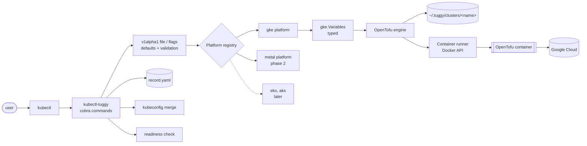
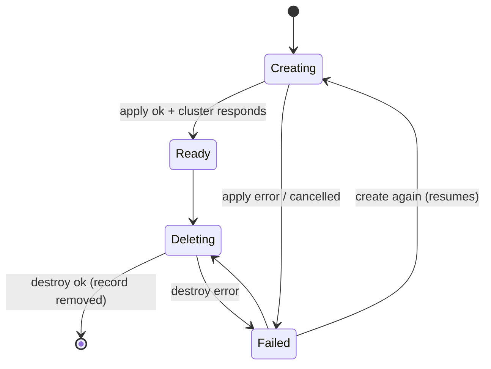

# 0001: Architecture and v0.1 design

| | |
|---|---|
| **Status** | Draft, under review |
| **Date** | 2026-10-04, updated 2026-10-07 |
| **Authors** | Dinesh Bakiaraj |

## Summary

`kubectl tuggy` is a kubectl plugin that acts as a sidekick for everyday Kubernetes work. Its first job is to create, list, and delete clusters with one command, starting with GKE and then bare metal. Other clouds (EKS, AKS) come later and plug in through the same platform interface without changes to the core. Later still, tuggy installs common tools into those clusters.

For cloud platforms, tuggy runs OpenTofu modules embedded in the binary, with inputs generated from the user's flags or spec file, inside a container. Users need only `kubectl`, a Docker-compatible container runtime, and cloud credentials they already have.

### Terminology

| Term | Meaning |
|---|---|
| **Platform** | A tuggy component that knows how to build one kind of cluster: `gke`, later `metal`, `eks`. Defined by tuggy's `Platform` Go interface. |
| **OpenTofu provider** | A plugin OpenTofu downloads to talk to a cloud API, such as `hashicorp/google`. Used inside a platform's `.tf` files. |
| **Module** | The fixed `.tf` files a cloud platform ships inside tuggy. |
| **Variables file** | `tuggy.tfvars.json`: the per-cluster input values for a module, generated by tuggy. |

## Background: the Sarayo demo

A demo built at Sarayo (September 2026) proved the approach end to end:

- A Go kubectl plugin (`kubectl-createcluster`, cobra + Docker's Go SDK) starts a "toolbox" container with a pinned OpenTofu and `gke-gcloud-auth-plugin`, mounts a `main.tf` folder and gcloud credentials, and runs `tofu apply` or `destroy`.
- `main.tf` creates a GKE zonal cluster, a separate `e2-small` node pool, and an nginx deployment, impersonating a service account. Only the cluster name is a variable; everything else is edited in the file.
- A real cluster was created in about 10 minutes. Helm installs of nginx and PostgreSQL were also demonstrated on that cluster and on a local kind cluster.

### What the demo taught us (requirements)

| # | Observation | Requirement for tuggy |
|---|---|---|
| R1 | The team runs it on Windows; setup guide is Windows-only | Windows, macOS, and Linux are all first-class. CI builds and tests on all three. |
| R2 | Setup takes 7 manual steps including building from source and editing PATH | Install with one command (`kubectl krew install tuggy`, or a downloaded release binary). |
| R3 | Users must edit their own copy of `main.tf` | No user-maintained OpenTofu code. Inputs come from flags or a spec file. |
| R4 | The guide warns "don't rely on the program's created/destroyed message" | tuggy's success message must be trustworthy: check exit codes and verify the cluster responds. |
| R5 | Most likely failure is missing IAM permission on the project | Check permissions before starting a 10-minute operation, and explain what is missing. |
| R6 | "Consider automated teardown safeguards to avoid billing" | Built-in expiry (TTL) for clusters and visible age and expiry in listings. |
| R7 | Helm installs were demoed as a next step | Design leaves room for `kubectl tuggy install <addon>` (phase 3). |
| R8 | The main.tf deploys a demo workload | Cluster creation and workload installation are separate concerns. |

### Defects in the demo code to avoid

1. The container exit code is never checked, so a failed `apply` still prints "created" (R4).
2. All clusters share one state file per folder. Creating cluster `b` after `a` replaces `a`.
3. `delete` runs `destroy -auto-approve` with no confirmation, and the state file, not `--name`, decides what is destroyed.
4. No signal handling. Ctrl-C leaves OpenTofu running and can leave state locked.
5. A private image in a personal Artifact Registry project.
6. Project, service account, zone, and a demo workload hard-coded in `main.tf`.
7. `--workdir` and `--gcloud` required on every call instead of credential discovery.
8. Relative, Windows-specific bind paths.
9. No check that Docker, `gcloud`, or the auth plugin exist.
10. Globals, `must()`/`os.Exit` error handling, no tests.
11. Output filtered by matching the text `Outputs:`; `Tty: true` merges stdout and stderr.
12. `get kubeconfig` prints YAML instead of merging into the user's kubeconfig.
13. `go.mod` marks cobra indirect; module named `kubectl-createcluster`.

## Goals

- One consistent UX across platforms.
- Safe by default: confirm before destroying, never act on the wrong cluster, report failure honestly.
- No per-user setup beyond cloud credentials.
- Transparent: users can inspect the OpenTofu code and state that built their cluster.
- Cost-aware: easy to see and clean up clusters that are costing money.

## Non-goals (v0.x)

- A server, controller, or background daemon. tuggy is a client-side CLI.
- Replacing Cluster API, Crossplane, or Gardener for fleet management.
- Managing clusters tuggy did not create, beyond listing them.

## User experience

### Commands

```sh
# Lifecycle
kubectl tuggy create cluster dev --platform gke --project my-proj --location us-central1-a [--ttl 8h]
kubectl tuggy create cluster -f cluster.yaml
kubectl tuggy create cluster dev ... --dry-run          # show the plan, change nothing
kubectl tuggy delete cluster dev                          # shows what will be destroyed, asks to confirm
kubectl tuggy delete clusters --expired                   # clean up everything past its TTL

# Inspect
kubectl tuggy get clusters [-o table|json|yaml] [--all]
kubectl tuggy describe cluster dev
kubectl tuggy get kubeconfig dev [--merge]

# Help
kubectl tuggy doctor [--platform gke] [--project my-proj]
kubectl tuggy version
```

### Conventions

- Verb-noun grammar like kubectl. Cluster name is a positional argument.
- Destructive commands show what will be removed and ask to confirm. `--yes` skips the prompt. If there is no terminal and no `--yes`, the command fails instead of proceeding.
- Any failure exits non-zero, with a short explanation and the path to the full log.
- Long operations show progress (resource being created, elapsed time), not raw OpenTofu output. `-v` streams the raw output.
- `get` supports `-o table|json|yaml` for scripting.

### Example session

```text
$ kubectl tuggy create cluster dev --platform gke --project acme-dev --location us-central1-a --ttl 8h
✓ Docker is running
✓ Google credentials found (alice@acme.com)
✓ Permissions OK on project acme-dev
• Planning: 2 resources to add
• Creating cluster dev ......... 8m31s
• Creating node pool default ... 54s
✓ Cluster responds (Kubernetes v1.34.1)
✓ Kubeconfig updated, current context is now "tuggy-dev"
Cluster dev is ready. It expires in 8h. Delete it sooner with: kubectl tuggy delete cluster dev

$ kubectl tuggy get clusters
NAME   PLATFORM   LOCATION        STATUS   AGE   EXPIRES
dev    gke        us-central1-a   Ready    9m    7h51m
```

### Spec file format (`tuggy.dev/v1alpha1`)

Users who prefer files over flags describe a cluster in YAML. The format follows the Kubernetes manifest layout (`apiVersion`, `kind`, `metadata`, `spec`), like kind and eksctl configs. Flags are the command-line form of the same format.

```yaml
apiVersion: tuggy.dev/v1alpha1
kind: Cluster
metadata:
  name: dev
spec:
  platform: gke
  kubernetesVersion: ""          # empty = platform default / release channel
  ttl: 8h                        # optional; empty or 0 = never expires
  nodePools:
    - name: default
      machineType: e2-standard-2
      count: 1
      spot: false
  platformConfig:                # owned and validated by the gke platform
    project: acme-dev
    location: us-central1-a      # zone = zonal cluster, region = regional
    releaseChannel: REGULAR
    network: default
    impersonateServiceAccount: "" # optional, as used in the demo
```

Rules:

- `internal/input/specfile/v1alpha1` is **the Go form of this file format only**. It is not the contract with platforms: each platform translates it into its own typed variables (see [Platform interface](#platform-interface)), and nothing after that step depends on it.
- The shared part holds only what every platform understands (name, version, TTL, node pools). Platform-specific settings sit under `platformConfig`, kept raw and decoded strictly by the selected platform.
- Loading is strict: unknown or duplicated fields, multiple documents, and the wrong `kind` or `apiVersion` are errors.
- The format is `v1alpha1` and may change. In particular, Cluster API manifests may become the file format later (see [Open questions](#open-questions)). Because platforms translate each input format separately, adding Cluster API means one new translation per platform and no change to modules or commands.

## Architecture



### Components

| Package | Responsibility |
|---|---|
| `internal/cli` | Cobra commands, flags, prompts, progress display, output printers. Talks only to interfaces; never imports a specific platform. |
| `internal/input/specfile/v1alpha1` | The spec file format: types, defaults, validation, strict loading. Internal so the format can change (or be replaced by Cluster API) without breaking outside users; it can be made public later. Other input formats get sibling packages under `internal/input/`. |
| `internal/platform` | `Platform` interface, shared types (`Plan`, `CheckResult`, `ClusterInfo`), and the registry. |
| `internal/platform/gke` | Everything GKE-specific: `platformConfig` type, translation to `gke.Variables`, credential discovery, preflight, embedded module, kubeconfig auth. |
| `internal/platform/metal` | Bare metal platform (phase 2). |
| `internal/platforms` | One file that blank-imports every built-in platform so they register themselves. The only place that changes when a platform is added. |
| `internal/engine/tofu` | Reusable OpenTofu helper: workspace, writing the variables file, init/plan/apply/destroy, JSON event parsing. Knows nothing about specific clouds. Used by cloud platforms; bare metal may not use it. |
| `internal/runner` | `Runner` interface for running a command in a container, with a Docker implementation and a fake for tests. |
| `internal/kubeconfig` | Merges kubeconfig entries with `client-go`. Platforms supply the entry. |
| `internal/clustermeta` | The cluster metadata store: `Store` interface for each cluster's record, folder, lock, and logs, with a local `~/.tuggy` implementation. Does not hold OpenTofu state or platform files. |

### Interfaces and extension points

Four interfaces separate what varies from what stays fixed:

| Interface | Implementations now | Later | Lets us add… |
|---|---|---|---|
| `Platform` | `gke` | `metal` (phase 2); `eks`, `aks` later | New platforms |
| `Runner` | Docker API (covers Docker, Podman, Colima, Rancher Desktop) | Local `tofu` binary | Running OpenTofu without containers |
| `Store` | Local `~/.tuggy` | GCS / S3 for teams | Shared cluster records |
| `Printer` | table, json, yaml | — | Output formats |

### Platform interface

`Platform` is a Go interface defined by tuggy (unrelated to OpenTofu providers). The CLI is written against it; each platform implements it in its own way.

```go
// internal/platform
type Platform interface {
    Name() string

    // FromV1Alpha1 translates the spec file format (or flags) into a Plan with
    // this platform's own typed variables. A FromCAPI method can be added later
    // for Cluster API manifests without changing anything below.
    FromV1Alpha1(c *v1alpha1.Cluster) (*Plan, error)

    // Checks run by create and by doctor: credentials, permissions, tools.
    Preflight(ctx context.Context, p *Plan) []CheckResult

    Create(ctx context.Context, p *Plan, opts CreateOptions) (*ClusterInfo, error)
    Delete(ctx context.Context, rec *clustermeta.Record, opts DeleteOptions) error

    // Describe reports the cluster's details (location, node pools, version)
    // from the platform's own files in dir, such as its variables file.
    Describe(ctx context.Context, rec *clustermeta.Record, dir string) (*ClusterInfo, error)

    // Kubeconfig returns the cluster, user (with exec auth plugin) and context entries to merge.
    Kubeconfig(ctx context.Context, rec *clustermeta.Record) (*clientcmdapi.Config, error)

    // ListRemote lists clusters in the cloud that tuggy didn't create, for
    // get --all. Platforms without a remote API return ErrNotSupported.
    ListRemote(ctx context.Context, opts ListOptions) ([]ClusterInfo, error)
}

// Plan is what a platform will build.
type Plan struct {
    Name      string        // cluster name
    TTL       time.Duration // 0 = never expires
    Variables any           // the platform's typed variables, e.g. gke.Variables
}

// Registry
func Register(p Platform)
func Get(name string) (Platform, error)
func Names() []string // used for --platform help and validation
```

What happens behind each method differs per platform:

| Method | `gke` | `metal` (phase 2) | `eks` (later) |
|---|---|---|---|
| `FromV1Alpha1` | Builds `gke.Variables` | Builds a host inventory | Builds `eks.Variables` |
| `Preflight` | Google credentials, IAM, Docker | SSH access to each machine | AWS credentials, quotas |
| `Create` | Writes module + variables file, runs OpenTofu | Installs Kubernetes over SSH (no OpenTofu) | Writes its module + variables file, runs OpenTofu |
| `Kubeconfig` | `gke-gcloud-auth-plugin` | Admin config from the server | `aws eks get-token` |

`CreateOptions` and `DeleteOptions` carry the cluster's directory, the shared cache directory, `DryRun`, a log writer, and an `OnProgress` callback for live progress (resource started, still running, done, failed). `DeleteOptions.Confirm` is called with the planned removals before anything is removed, so the CLI can ask the user; a dry-run `Create` returns the planned changes in `ClusterInfo.Changes`.

Rules that keep platforms pluggable:

- **The core never imports a platform package.** `internal/cli` works only with `platform.Get(name)`. Platforms register themselves in `init()`, and `internal/platforms` blank-imports them.
- **Each platform owns all of its cloud-specific code:** `platformConfig` type, typed variables, credential discovery, preflight checks, OpenTofu module (embedded from inside its own package, as `go:embed` requires), and kubeconfig auth plugin. Nothing cloud-specific lives in shared packages.
- **Shared helpers are libraries, not requirements.** Cloud platforms use `engine/tofu` and `runner`; bare metal can use SSH instead and still satisfy `Platform`.
- **Flags.** Common flags (`--ttl`, node pool flags) are defined by the CLI. Platform-specific flags (`--project`, `--location`) are added by the platform through an optional `FlagBinder` interface, so `--help` only shows flags for the chosen platform.

Adding EKS later means: a new `internal/platform/eks` package with its module and variables type, plus one import line in `internal/platforms`. No changes to the CLI, spec file format, store, engine, or runner.

### Typed module variables

Each cloud platform defines a Go struct that mirrors its module's `variables.tf` exactly, and writes it to the variables file, `tuggy.tfvars.json`, with `json.Marshal`:

```go
// internal/platform/gke/variables.go
type Variables struct {
    Name              string            `json:"name"`
    Project           string            `json:"project"`
    Location          string            `json:"location"`
    KubernetesVersion *string           `json:"kubernetes_version"`
    ReleaseChannel    string            `json:"release_channel"`
    NodePools         []NodePool        `json:"node_pools"`
    Labels            map[string]string `json:"labels"`
}
```

- The compiler catches mistakes in variable names and types that would otherwise surface only when OpenTofu runs.
- A contract test checks that the struct's fields and the module's declared variables match exactly, so Go code and `.tf` files cannot drift apart.
- Translations (`FromV1Alpha1`, later `FromCAPI`) are plain Go functions with table-driven tests.
- The file is named `tuggy.tfvars.json`, which OpenTofu does not load by itself. The engine reads it on the host and passes each value as a `TF_VAR_<name>` environment variable (strings as they are, other values as compact JSON). Engines that run in a VM (Colima, Docker Desktop) show host file changes to containers up to about a second late: a replaced file briefly appears missing and an overwritten one stale, which was measured on Colima with virtiofs. Environment variables avoid depending on that. Users can still run `tofu plan -var-file=tuggy.tfvars.json` by hand.

## Local state

Everything tuggy knows lives under `~/.tuggy` (`%USERPROFILE%\.tuggy` on Windows). Directories are created with owner-only permissions because OpenTofu state can contain secrets.

```text
~/.tuggy/                                  (%USERPROFILE%\.tuggy on Windows)
├── config.yaml                            user defaults: platform, project, location, ttl, image
├── logs/<name>/                           logs of deleted clusters
├── locks/<name>.lock                      held while a command works on a cluster
├── cache/plugins/                         OpenTofu provider downloads, shared by all clusters
└── clusters/
    └── dev/
        ├── record.yaml                    tuggy's facts: platform, status, created, ttl, version, outputs
        ├── tuggy.tfvars.json              inputs for this cluster: the single source for what was asked
        ├── versions.tf                    ┐
        ├── variables.tf                   │ the platform's module, copied unchanged from tuggy
        ├── main.tf                        │
        ├── outputs.tf                     │
        ├── .terraform.lock.hcl            ┘ pinned OpenTofu provider versions, shipped with the module
        ├── .terraform/                    created by `tofu init`; links to the shared plugin cache
        ├── terraform.tfstate              this cluster's state only
        ├── terraform.tfstate.backup       previous state, written by OpenTofu
        └── logs/
            └── 2026-10-07T15-02-11-create.log
```

| File | Written by | When |
|---|---|---|
| `record.yaml` | tuggy | Start of `create` (`Creating`), then at each status change |
| `tuggy.tfvars.json` | tuggy | Before OpenTofu runs |
| `*.tf`, `.terraform.lock.hcl` | tuggy | Once, copied from the binary |
| `.terraform/` | OpenTofu | `tofu init` |
| `terraform.tfstate`, `.backup` | OpenTofu | During `apply` and `destroy` |
| `logs/*.log` | tuggy | Every run |
| `locks/<name>.lock` | tuggy | Held during a command; the operating system releases it if tuggy exits or crashes |

Locks live outside the cluster folder because a cluster must be locked before its folder exists and while the folder is removed (Windows cannot delete a folder containing an open, locked file).

Not kept: the saved plan file between `plan` and `apply` (`tfplan-<id>`, a new name each time; it can contain secrets, so tuggy deletes it after use), and the downloaded OpenTofu provider plugins, which live in `~/.tuggy/cache/plugins` and are shared by every cluster. The original spec file is not copied either: everything it said is in `tuggy.tfvars.json`, and the platform can rebuild a spec from that if needed. After `delete`, the cluster's folder is removed and its logs move to `~/.tuggy/logs/<name>/`.

### Record

tuggy has no server, so each command starts knowing nothing. `record.yaml` is how later commands learn what earlier ones did. It has the same shape for every platform, so `get clusters`, expiry warnings, and `delete` work without understanding any platform's files.

The record holds **only facts that belong to tuggy** and that the variables file cannot hold: the platform, run status, timestamps, expiry, tuggy version, and outputs that exist only after creation. Everything the user asked for (project, location, node pools) lives only in the platform's own files, such as the variables file. Commands that need those details ask the platform through `Describe`, so every fact has exactly one home.

```yaml
name: dev
platform: gke
status: Ready                      # Creating | Ready | Failed | Deleting
message: ""                        # why the last operation failed, if it did
createdAt: "2026-10-07T15:02:11Z"
updatedAt: "2026-10-07T15:13:40Z"
expiresAt: "2026-10-07T23:02:11Z"  # created + ttl; absent = never expires
tuggyVersion: v0.1.0               # which tuggy, and so which module, built it
outputs:
  endpoint: https://34.123.45.67
  caCertificate: LS0tLS1CRUdJTi...
```

Why not use the variables file or OpenTofu state as the record: the variables file is OpenTofu's input, written before a run, while status and outputs change during and after it; OpenTofu state does not contain tuggy's facts and its layout is OpenTofu's internal format; and bare metal will have neither.

The status lets tuggy recover from interruptions:



- Running `create` on a `Failed` cluster re-applies the same variables file, so a half-built cluster is completed, not duplicated.
- Running `create` on a `Ready` cluster is an error ("already exists").
- Each cluster keeps the module copy it was built with. If a newer tuggy ships a changed module, existing clusters keep using their copy until an explicit upgrade (later phase).

Remote state (GCS/S3) for teams is a later phase. The record format leaves room for a `backend` field.

## Command flows

### create

1. Parse flags or the file into a `v1alpha1.Cluster`, apply defaults, validate.
2. Look up the platform and translate: `FromV1Alpha1` returns a `Plan` with typed variables. Platform-specific validation happens here.
3. Take the cluster's lock, so no other tuggy command can work on it at the same time. Then refuse if a record with that name exists and is `Ready` or `Deleting`.
4. Preflight: container runtime reachable, credentials found, required IAM permissions present (R5), required APIs enabled. Stop with a clear message on the first blocking failure.
5. Write the workspace (module, variables file) and `record.yaml` with status `Creating`.
6. In the container: `tofu init`, then `tofu plan -out=tfplan-<id>`, then `tofu apply tfplan-<id>`. Applying the saved plan guarantees we apply exactly what was planned. `--dry-run` stops after plan and prints a summary.
7. Read outputs with `tofu output -json` and store them in the record.
8. Verify: build a kubeconfig and call `/readyz` and `/version` on the API server, retrying for up to 2 minutes (R4).
9. Merge kubeconfig (unless `--no-kubeconfig`). Mark `Ready`. Release lock.

On error or Ctrl-C: stop the container gracefully, mark `Failed`, keep the workspace, and print how to resume or clean up.

### delete

1. Load the record. Unknown name is an error. The state file for that cluster alone is used, so only that cluster can be affected.
2. Run `tofu plan -destroy` and show the summary: "Will destroy GKE cluster `dev` and 1 node pool in project `acme-dev`."
3. Confirm (`--yes` skips). Mark `Deleting`.
4. `tofu apply` the destroy plan. Remove the kubeconfig context tuggy added. Delete the record and workspace (keep logs in `~/.tuggy/logs/`).

### get clusters

Reads every record for name, platform, status, age, and expiry, and asks each record's platform to `Describe` it for location. `--refresh` (or `describe`) checks the API server is reachable. `--all` also lists clusters in the cloud that tuggy did not create, marked `unmanaged`.

### doctor

Runs every platform's preflight checks and prints pass/fail with a fix for each failure, for example "Run `gcloud auth application-default login`". The same checks run at the start of `create`, before anything is built (R5).

GKE checks, in order (later checks are skipped when one they depend on fails):

| Check | Fails or warns when | Fix shown |
|---|---|---|
| Container engine | Docker API not reachable | Start Docker Desktop, Colima, …; check `docker ps` |
| gke-gcloud-auth-plugin | Not on PATH (warning: only kubectl and the readiness check need it; tuggy runs it with `--use_application_default_credentials`) | `gcloud components install gke-gcloud-auth-plugin` |
| Google credentials | No ADC file, unreadable, or unsupported type | `gcloud auth application-default login` |
| Google sign-in | Credentials can't produce an access token (expired, revoked) | `gcloud auth application-default login` |
| Impersonate *sa* (if set) | Caller can't impersonate the service account | Grant `roles/iam.serviceAccountTokenCreator` on it |
| Kubernetes Engine API | `container.googleapis.com` disabled (warning if it can't be read) | `gcloud services enable container.googleapis.com --project P` |
| Permissions | Missing any of `container.clusters.{create,get,update,delete}`, `container.operations.get`, `iam.serviceAccounts.actAs` (checked as the impersonated account when set) | Grant `roles/container.admin` and `roles/iam.serviceAccountUser` |

## OpenTofu engine and container runner

### Image

- The official OpenTofu image, `ghcr.io/opentofu/opentofu`, replaces the demo's private toolbox image. It is multi-architecture, includes CA certificates, `git` and `ssh`, and has `tofu` as its entrypoint, so tuggy does not build or publish an image of its own.
- Each tuggy release pins an exact version by digest (`internal/engine/tofu.DefaultImage`), so a tuggy version always runs the same OpenTofu even if the tag is re-published. `kubectl tuggy version` prints it.
- `TUGGY_TOFU_IMAGE` (later also `config.yaml`) overrides it, for internal mirrors.
- When running as a non-root user (Linux), tuggy sets `HOME` to a writable directory inside the container.
- A tuggy-built image would only be added if a future platform needs extra tools in the container; the override means no code change for users.
- Pulled on first use, with progress shown. If pulling fails but the image is present locally, tuggy continues (as the demo did).

The GKE module does not use the Kubernetes OpenTofu provider (no workloads in the module, R8), so the image does not need `gke-gcloud-auth-plugin`.

### Running a container

| Concern | Design |
|---|---|
| Runtime | Docker Engine API (`github.com/moby/moby/client`). Works with Docker Engine, Docker Desktop, Colima, Rancher Desktop, OrbStack, Podman. |
| Engine discovery | Same order as the `docker` CLI, so tuggy uses whatever engine `docker ps` uses: `DOCKER_HOST`, then `DOCKER_CONTEXT`, then the current context in `~/.docker/config.json`, then the OS default (`/var/run/docker.sock`, or the `docker_engine` named pipe on Windows). |
| Shared folders | Engines that run in a VM (Docker Desktop, Colima, Rancher Desktop) share only the home directory by default. `~/.tuggy` is under it; a custom `TUGGY_HOME` must be too. |
| Mounts | Workspace read-write at `/workspace`. Credentials read-only. `~/.tuggy/cache/plugins` at `/plugin-cache` for OpenTofu provider downloads (a host folder rather than a Docker volume, because a Docker volume is owned by root and the container runs as the user on Linux). |
| Paths | Host paths resolved to absolute paths and converted for Windows. |
| Output | `Tty: false`; demultiplex stdout and stderr. OpenTofu runs with `-json` so progress comes from structured events, not text matching. Full output is written to the log file. |
| Success | Decided by `ContainerWait` exit code only. |
| Cancellation | Ctrl-C sends SIGINT to OpenTofu so it can release the state lock, waits up to 60s, then kills. Containers run with a small init process so the signal reaches OpenTofu. Starting a container is never cut short, so a Ctrl-C right after start still stops it gracefully. |
| File ownership | On Linux, run as the caller's UID/GID so the workspace is not left root-owned. |
| Cleanup | Containers are labelled `dev.tuggy.cluster=<name>` and removed after each run. |

## Credentials

tuggy discovers credentials; flags only override. Discovery belongs to each platform, which returns the mounts and environment variables the runner should pass to the container.

| Platform | Discovery order | Passed to container |
|---|---|---|
| GKE | `GOOGLE_APPLICATION_CREDENTIALS`; gcloud ADC file (`~/.config/gcloud/application_default_credentials.json`, `%APPDATA%\gcloud\…` on Windows) | Single file mounted read-only, `GOOGLE_APPLICATION_CREDENTIALS` set. Optional `impersonateServiceAccount` passed as a module variable. |
| EKS (later) | `AWS_*` env vars, `AWS_PROFILE`, `~/.aws` | Env vars and `~/.aws` mounted read-only |

Only the single credentials file is mounted, not the whole gcloud folder.

## GKE module (`internal/platform/gke/module`)

**Variables** (mirrored by `gke.Variables`): `name`, `project`, `location`, `release_channel`, `kubernetes_version` (optional), `network`, `subnetwork`, `node_pools` (list of name, machine type, count, spot, disk size), `labels`, `impersonate_service_account` (optional), `deletion_protection` (default false for v0.1).

**Resources:** `google_container_cluster` with the default node pool removed (as in the demo), Workload Identity enabled, and legacy client certificates turned off (users sign in with their Google identity). One `google_container_node_pool` per entry in `node_pools`, with auto-repair and auto-upgrade on.

**Provider:** `hashicorp/google ~> 8.6`, pinned with checksums in the module's `.terraform.lock.hcl` for linux/amd64 and linux/arm64 (where OpenTofu runs in the container).

**Outputs:** `name`, `location`, `project`, `endpoint`, `ca_certificate`, `kubernetes_version`.

**Labels on every resource:** `managed-by=tuggy`, `tuggy-cluster=<name>`, and `tuggy-expires-at=<unix time>` when a TTL is set, through the provider's `default_labels` and on the node VMs. These let `get clusters --all` and cost reports identify tuggy clusters.

**Tests:** `tests/gke.tftest.hcl` runs with a mock Google provider (no account needed): cluster and pool settings, outputs, labels, and rejection of invalid input. A Go test runs `fmt`, `validate` and `tofu test` in the pinned OpenTofu container.

The demo's nginx deployment is not part of the module.

## Cost safeguards (R6)

- `--ttl` sets an expiry stored in the record and as a cloud label.
- `get clusters` shows age and time left. Every tuggy command prints a one-line warning when a managed cluster has expired.
- `delete clusters --expired` removes all expired clusters after one confirmation.
- No background process enforces TTLs in v0.x. A later phase may add an optional scheduled cleanup job in the user's cloud.
- `config.yaml` can set a default TTL so teams get safe behaviour without remembering the flag.

## Kubeconfig

- Each platform builds its entry from its outputs, including the exec auth plugin (`gke-gcloud-auth-plugin` for GKE; `aws eks get-token` for EKS later). `doctor` checks the plugin is installed on the host.
- Changes go through client-go's `clientcmd.ModifyConfig`, the function `kubectl config` uses: it honours `KUBECONFIG` (including lists of files, writing new entries to the first existing one), locks while writing, and keeps files owner-only.
- Every cluster, user and context tuggy writes is named `tuggy-<name>`; tuggy refuses to add or remove entries with other names, so the user's own entries are never touched. Re-creating a cluster replaces its `tuggy-` entries.
- `create` merges and switches context by default. `delete` removes the context and, unless another context still uses them, its cluster and user; if it was the current context, none is current afterwards.
- **Readiness (R4):** after `create`, tuggy connects exactly as kubectl would (same exec plugin) and waits for `/readyz` to answer `ok`, then reads `/version`, retrying every 5s for up to 2 minutes. The cluster's CA certificate is always verified. Rejected credentials are reported plainly ("the cluster rejected the credentials (Unauthorized)").
- **One Google sign-in for GKE:** by default `gke-gcloud-auth-plugin` uses the gcloud CLI sign-in (`gcloud auth login`), which is separate from the Application Default Credentials (ADC) OpenTofu uses and expires independently. tuggy writes the plugin with `--use_application_default_credentials`, so kubectl and the readiness check use ADC too and users keep only `gcloud auth application-default login` fresh. When a cluster was built by impersonating a service account, kubectl connects as the user's own ADC identity, which needs GKE access in the project (for example `roles/container.developer`).

## Add-ons (phase 3, outline only)

`kubectl tuggy install <addon> [--cluster dev]` installs curated Helm charts (for example ingress-nginx, cert-manager, PostgreSQL) using the Helm Go SDK on the host. Each add-on is a small definition: chart, version, default values, and post-install checks. A separate design doc will cover it.

## Errors and output

- Errors are wrapped with context and printed once at the top level, with a hint when one is known (for example a missing permission names the role to grant).
- Exit codes: `0` success, `1` general failure, `2` invalid input, `3` preflight failed, `4` cancelled by user, `5` cloud operation failed.
- No telemetry.

## Repository layout

```
cmd/kubectl-tuggy/              main package (wires cobra, nothing else)
internal/cli/
internal/input/specfile/v1alpha1/   spec file format (flags fill the same type)
internal/input/capi/                later: Cluster API manifests as input
internal/platform/              Platform interface, shared types, registry
internal/platform/gke/          platformConfig, variables, credentials, preflight, kubeconfig
internal/platform/gke/module/   embedded OpenTofu module (*.tf)
internal/platform/metal/        phase 2
internal/platforms/             blank imports of built-in platforms
internal/engine/tofu/
internal/runner/
internal/kubeconfig/
internal/clustermeta/           cluster metadata store: records, folders, locks, logs
docs/  hack/  .github/workflows/
```

## Testing

- **Unit:** spec validation, defaulting, translation to typed variables, kubeconfig merge, store and state transitions.
- **Contract:** each platform's variables struct matches its module's declared variables.
- **Engine:** run against a fake runner that replays recorded OpenTofu JSON output, covering success, failure, and cancellation.
- **Modules:** `tofu fmt -check`, `tofu validate`, and `tofu test` with mocked OpenTofu providers in CI.
- **End-to-end:** creates and deletes a real GKE cluster in a sandbox project. Manual trigger or nightly only, because it costs money. Always runs `delete` in a cleanup step.
- **Operating systems:** unit tests on Linux, macOS, and Windows in CI (R1).

## Release

- GoReleaser builds for linux, darwin, and windows on amd64 and arm64.
- SHA-256 checksums, SBOM, and cosign keyless signatures.
- Krew manifest generated per release; submit to the Krew index after v0.1 (R2).
- The pinned OpenTofu image digest is part of each release and shown by `kubectl tuggy version`.
- SemVer. The `v1alpha1` spec file format may change before v1.0, always called out in release notes.

## Phases

| Phase | Version | Scope |
|---|---|---|
| 0 | n/a | Repo bootstrap and this design |
| 1 | v0.1.0 | Spec file format, store, engine, runner, GKE platform and module, create/delete/get/describe/kubeconfig/doctor, TTL, CI, release |
| 2 | v0.2.0 | Bare metal platform |
| 3 | v0.3.0 | `install <addon>` with Helm; Krew index submission; docs site at tuggy.dev |
| Later | | EKS and AKS platforms, Cluster API manifests as input, `upgrade cluster`, `scale nodepool`, remote state, scheduled TTL cleanup |

## Open questions

1. **Bare metal approach.** k3s over SSH, kubeadm over SSH, or Talos. Decide before phase 2.
2. **GKE defaults.** Decided for v0.1: no default location (the user picks a zone or region), default machine type `e2-standard-2`, release channel `REGULAR`, network `default`. Still open: Autopilot as an option?
3. **Default TTL.** Should clusters expire by default (for example 24h) unless `--ttl 0`? Safer for cost, but surprising for long-lived clusters.
4. **Network.** Use the project's `default` network in v0.1, or create a dedicated VPC per cluster?
5. **Impersonation.** The demo impersonates an `opentofu@` service account. Keep it as an optional input, or recommend it as the default setup?
6. **Cluster API manifests as the file format.** Preferred long term, because it is an open format. Starting with `v1alpha1` for v0.1. Gaps to resolve before adopting it:
   - resolving several linked objects (`infrastructureRef`, `controlPlaneRef`, machine pool templates)
   - a documented mapping from supported CAPI/CAPG fields to module variables, rejecting the rest
   - `apply -f` for edits, blocking changes that would recreate the cluster
   - filling CAPI `status` from records and outputs
   - tuggy-only settings such as TTL as annotations (`tuggy.dev/ttl`)
   - pinning CAPI and CAPG API versions, and choosing Go type imports or CRD schema validation
   - users expecting continuous reconciliation, which OpenTofu does not provide (an on-demand drift check covers GKE)
   - bare metal, where CAPI's providers assume CAPI controllers
