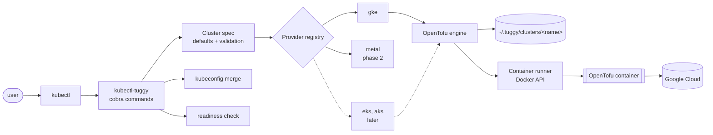
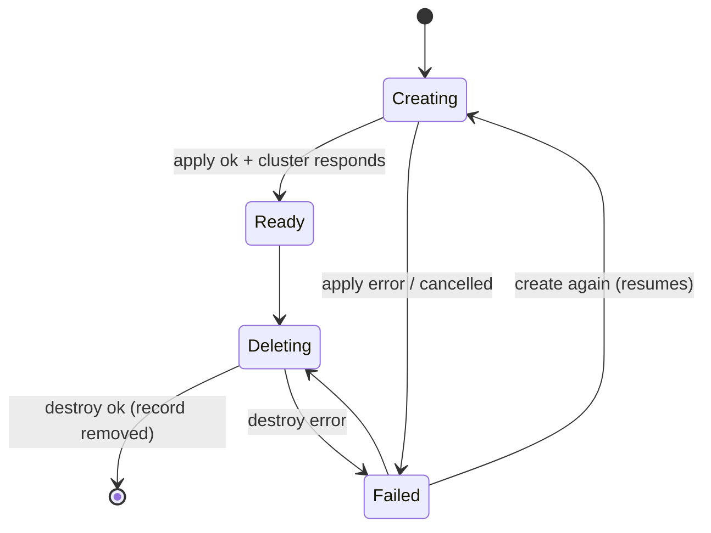

# 0001: Architecture and v0.1 design

| | |
|---|---|
| **Status** | Draft, under review |
| **Date** | 2026-10-04 |
| **Authors** | Dinesh Bakiaraj |

## Summary

`kubectl tuggy` is a kubectl plugin that acts as a sidekick for everyday Kubernetes work. Its first job is to create, list, and delete clusters with one command, starting with GKE and then bare metal. Other clouds (EKS, AKS) come later and plug in through the same provider interface without changes to the core. Later still, tuggy installs common tools into those clusters.

For cloud providers, tuggy generates an OpenTofu configuration from modules embedded in the binary and runs OpenTofu inside a container. Users need only `kubectl`, a Docker-compatible container runtime, and cloud credentials they already have.

## Background: the Sarayo demo

A demo built at Sarayo (September 2026) proved the approach end to end:

- A Go kubectl plugin (`kubectl-createcluster`, cobra + Docker's Go SDK) starts a "toolbox" container with a pinned OpenTofu and `gke-gcloud-auth-plugin`, mounts a `main.tf` folder and gcloud credentials, and runs `tofu apply` or `destroy`.
- `main.tf` creates a GKE zonal cluster, a separate `e2-small` node pool, and an nginx deployment, impersonating a service account.
- A real cluster was created in about 10 minutes. Helm installs of nginx and PostgreSQL were also demonstrated on that cluster and on a local kind cluster.

### What the demo taught us (requirements)

| # | Observation | Requirement for tuggy |
|---|---|---|
| R1 | The team runs it on Windows; setup guide is Windows-only | Windows, macOS, and Linux are all first-class. CI builds and tests on all three. |
| R2 | Setup takes 7 manual steps including building from source and editing PATH | Install with one command (`kubectl krew install tuggy`, or a downloaded release binary). |
| R3 | Users must edit their own copy of `main.tf` | No user-maintained OpenTofu code. Inputs come from flags or a spec file. |
| R4 | The guide warns "don't rely on the program's created/destroyed message" | tuggy's success message must be trustworthy: check exit codes and verify the cluster responds. |
| R5 | Most likely failure is missing IAM permission on the project | Check permissions before starting a 10-minute operation, and explain what is missing. |
| R6 | "Consider automated teardown safeguards to avoid billing" | Built-in expiry (TTL) for clusters and visible age and expiry in listings. |
| R7 | Helm installs were demoed as a next step | Design leaves room for `kubectl tuggy install <addon>` (phase 3). |
| R8 | The main.tf deploys a demo workload | Cluster creation and workload installation are separate concerns. |

### Defects in the demo code to avoid

1. The container exit code is never checked, so a failed `apply` still prints "created" (R4).
2. All clusters share one state file per folder. Creating cluster `b` after `a` replaces `a`.
3. `delete` runs `destroy -auto-approve` with no confirmation, and the state file, not `--name`, decides what is destroyed.
4. No signal handling. Ctrl-C leaves OpenTofu running and can leave state locked.
5. A private image in a personal Artifact Registry project.
6. Project, service account, zone, and a demo workload hard-coded in `main.tf`.
7. `--workdir` and `--gcloud` required on every call instead of credential discovery.
8. Relative, Windows-specific bind paths.
9. No check that Docker, `gcloud`, or the auth plugin exist.
10. Globals, `must()`/`os.Exit` error handling, no tests.
11. Output filtered by matching the text `Outputs:`; `Tty: true` merges stdout and stderr.
12. `get kubeconfig` prints YAML instead of merging into the user's kubeconfig.
13. `go.mod` marks cobra indirect; module named `kubectl-createcluster`.

## Goals

- One consistent UX across providers.
- Safe by default: confirm before destroying, never act on the wrong cluster, report failure honestly.
- No per-user setup beyond cloud credentials.
- Transparent: users can inspect the OpenTofu code and state that built their cluster.
- Cost-aware: easy to see and clean up clusters that are costing money.

## Non-goals (v0.x)

- A server, controller, or background daemon. tuggy is a client-side CLI.
- Replacing Cluster API, Crossplane, or Gardener for fleet management.
- Managing clusters tuggy did not create, beyond listing them.

## User experience

### Commands

```sh
# Lifecycle
kubectl tuggy create cluster dev --provider gke --project my-proj --location us-central1-a [--ttl 8h]
kubectl tuggy create cluster -f cluster.yaml
kubectl tuggy create cluster dev ... --dry-run          # show the plan, change nothing
kubectl tuggy delete cluster dev                          # shows what will be destroyed, asks to confirm
kubectl tuggy delete clusters --expired                   # clean up everything past its TTL

# Inspect
kubectl tuggy get clusters [-o table|json|yaml] [--all]
kubectl tuggy describe cluster dev
kubectl tuggy get kubeconfig dev [--merge]

# Help
kubectl tuggy doctor [--provider gke] [--project my-proj]
kubectl tuggy version
```

### Conventions

- Verb-noun grammar like kubectl. Cluster name is a positional argument.
- Destructive commands show what will be removed and ask to confirm. `--yes` skips the prompt. If there is no terminal and no `--yes`, the command fails instead of proceeding.
- Any failure exits non-zero, with a short explanation and the path to the full log.
- Long operations show progress (resource being created, elapsed time), not raw OpenTofu output. `-v` streams the raw output.
- `get` supports `-o table|json|yaml` for scripting.

### Example session

```text
$ kubectl tuggy create cluster dev --provider gke --project acme-dev --location us-central1-a --ttl 8h
✓ Docker is running
✓ Google credentials found (alice@acme.com)
✓ Permissions OK on project acme-dev
• Planning: 2 resources to add
• Creating cluster dev ......... 8m31s
• Creating node pool default ... 54s
✓ Cluster responds (Kubernetes v1.34.1)
✓ Kubeconfig updated, current context is now "tuggy-dev"
Cluster dev is ready. It expires in 8h. Delete it sooner with: kubectl tuggy delete cluster dev

$ kubectl tuggy get clusters
NAME   PROVIDER   LOCATION        STATUS   AGE   EXPIRES
dev    gke        us-central1-a   Ready    9m    7h51m
```

### Cluster spec

Flags and `-f` files map to one versioned type. This is the contract between the CLI and providers.

```yaml
apiVersion: tuggy.dev/v1alpha1
kind: Cluster
metadata:
  name: dev
spec:
  provider: gke
  kubernetesVersion: ""          # empty = provider default / release channel
  ttl: 8h                        # optional; empty = never expires
  nodePools:
    - name: default
      machineType: e2-standard-2
      count: 1
      spot: false
  providerConfig:                # owned and validated by the gke provider
    project: acme-dev
    location: us-central1-a      # zone = zonal cluster, region = regional
    releaseChannel: REGULAR
    network: default
    impersonateServiceAccount: "" # optional, as used in the demo
```

The core spec only holds fields every provider understands (name, version, TTL, node pools). Everything provider-specific sits under `providerConfig`, which the core keeps as raw YAML and hands to the selected provider to decode and validate into its own type. Adding a provider never changes `pkg/apis`.

Validation happens before anything runs: the core checks common fields (name format, RFC 1123, max 40 chars to fit cloud limits; TTL), then the provider checks its config.

## Architecture



### Components

| Package | Responsibility |
|---|---|
| `internal/cli` | Cobra commands, flags, prompts, progress display, output printers. Talks only to interfaces; never imports a specific provider. |
| `pkg/apis/v1alpha1` | `Cluster` type with common fields and raw `providerConfig`; defaulting and common validation. Public so other tools can generate specs. |
| `internal/provider` | `Provider` interface, shared types (`CheckResult`, `ClusterInfo`), and the registry. |
| `internal/provider/gke` | Everything GKE-specific: config type, validation, credential discovery, preflight, embedded module, kubeconfig auth. |
| `internal/provider/metal` | Bare metal provider (phase 2). |
| `internal/engine/tofu` | Reusable OpenTofu helper: workspace, tfvars, init/plan/apply/destroy, JSON event parsing. Knows nothing about specific clouds. Used by cloud providers; bare metal may not use it. |
| `internal/runner` | `Runner` interface for running a command in a container, with a Docker implementation and a fake for tests. |
| `internal/kubeconfig` | Merges kubeconfig entries with `client-go`. Providers supply the entry. |
| `internal/store` | `Store` interface for cluster records and locks, with a local `~/.tuggy` implementation. |
| `internal/providers` | One file that blank-imports every built-in provider so they register themselves. The only place that changes when a provider is added. |

### Interfaces and extension points

Four interfaces separate what varies from what stays fixed:

| Interface | Implementations now | Later | Lets us add… |
|---|---|---|---|
| `Provider` | `gke` | `metal` (phase 2); `eks`, `aks` later | New platforms |
| `Runner` | Docker API (covers Docker, Podman, Colima, Rancher Desktop) | Local `tofu` binary | Running OpenTofu without containers |
| `Store` | Local `~/.tuggy` | GCS / S3 for teams | Shared cluster records |
| `Printer` | table, json, yaml | — | Output formats |

```go
// internal/provider
type Provider interface {
    Name() string

    // Decode and validate this provider's part of the spec (spec.providerConfig).
    DecodeConfig(raw []byte) (Config, error)

    // Checks run by create and by doctor. Includes credentials and permissions.
    Preflight(ctx context.Context, c *Cluster) []CheckResult

    Create(ctx context.Context, c *Cluster, opts CreateOptions) (*ClusterInfo, error)
    Delete(ctx context.Context, rec *store.Record, opts DeleteOptions) error

    // Returns the cluster, user (with exec auth plugin) and context entries to merge.
    Kubeconfig(ctx context.Context, rec *store.Record) (*clientcmdapi.Config, error)

    // Clusters in the cloud that tuggy didn't create, for get --all. Optional:
    // providers without a remote API return ErrNotSupported.
    ListRemote(ctx context.Context, opts ListOptions) ([]ClusterInfo, error)
}

// Registry
func Register(p Provider)
func Get(name string) (Provider, error)
func Names() []string // used for --provider help and validation
```

Rules that keep providers pluggable:

- **The core never imports a provider package.** `internal/cli` works only with `provider.Get(name)`. Providers register themselves in `init()`, and `internal/providers` blank-imports them.
- **Each provider owns all of its cloud-specific code:** config type, credentials discovery, preflight checks, OpenTofu module (embedded from inside its own package), and kubeconfig auth plugin. Nothing cloud-specific lives in shared packages.
- **Shared helpers are libraries, not requirements.** Cloud providers use `engine/tofu` and `runner`; bare metal can use SSH instead and still satisfy `Provider`.
- **Flags.** Common flags (`--name`, `--ttl`, node pool flags) are defined by the CLI. Provider-specific flags (`--project`, `--location`) are added by the provider through an optional `FlagBinder` interface, so `--help` only shows flags for the chosen provider.

Adding EKS later means: a new `internal/provider/eks` package with its module, plus one import line in `internal/providers`. No changes to the CLI, spec, store, engine, or runner.

## Local state

Everything tuggy knows lives under `~/.tuggy` (`%USERPROFILE%\.tuggy` on Windows). Directories are created with owner-only permissions because OpenTofu state can contain secrets.

```
~/.tuggy/
  config.yaml                    # user defaults (provider, project, location, image)
  clusters/
    dev/
      cluster.yaml               # the spec as created
      record.yaml                # status, timestamps, tuggy + module version, outputs
      main.tf, *.tf              # copy of the embedded module used (inspectable)
      terraform.tfvars.json      # generated inputs
      terraform.tfstate          # this cluster's state only
      logs/2026-10-04T15-02-11-create.log
      .lock
```

`record.yaml` holds a status so tuggy can recover from interruptions:



- Running `create` on a `Failed` cluster re-applies the same spec, so a half-built cluster is completed, not duplicated.
- Running `create` on a `Ready` cluster is an error ("already exists").
- The record stores the module version. If a newer tuggy ships a changed module, existing clusters keep using their recorded copy until an explicit upgrade (later phase).

Remote state (GCS/S3) for teams is a later phase. The record format leaves room for a `backend` field.

## Command flows

### create

1. Parse flags or file into a `Cluster`, apply defaults, validate.
2. Refuse if a record with that name exists and is `Ready` or `Deleting`.
3. Preflight: container runtime reachable, credentials found, required IAM permissions present (R5), required APIs enabled. Stop with a clear message on the first blocking failure.
4. Write workspace and `record.yaml` with status `Creating`. Take the lock.
5. In the container: `tofu init`, then `tofu plan -out=plan`, then `tofu apply plan`. Applying the saved plan guarantees we apply exactly what was planned. `--dry-run` stops after plan and prints a summary.
6. Read outputs with `tofu output -json`.
7. Verify: build a kubeconfig and call `/readyz` and `/version` on the API server, retrying for up to 2 minutes (R4).
8. Merge kubeconfig (unless `--no-kubeconfig`). Mark `Ready`. Release lock.

On error or Ctrl-C: stop the container gracefully, mark `Failed`, keep the workspace, and print how to resume or clean up.

### delete

1. Load the record. Unknown name is an error. The state file for that cluster alone is used, so only that cluster can be affected.
2. Run `tofu plan -destroy` and show the summary: "Will destroy GKE cluster `dev` and 1 node pool in project `acme-dev`."
3. Confirm (`--yes` skips). Mark `Deleting`.
4. `tofu apply` the destroy plan. Remove the kubeconfig context tuggy added. Delete the record and workspace (keep logs in `~/.tuggy/logs/`).

### get clusters

Reads local records. Status is from the record; `--refresh` (or `describe`) checks the API server is reachable. `--all` also lists clusters in the cloud that tuggy did not create, marked `unmanaged`.

### doctor

Runs every provider's preflight checks and prints pass/fail with a fix for each failure, for example "Run `gcloud auth application-default login`".

## OpenTofu engine and container runner

### Image

- Default is a tuggy image, `ghcr.io/tuggy-dev/tofu:<version>`, published from this repo, built `FROM` the official OpenTofu image. It replaces the demo's private toolbox image. It exists so we control the OpenTofu version and can add tools if a provider needs them.
- The image is pinned by digest in each tuggy release, so a tuggy version always runs the same OpenTofu.
- `--tofu-image` or `config.yaml` overrides it, for air-gapped mirrors.
- Pulled on first use, with progress shown. If pulling fails but the image is present locally, tuggy continues (as the demo did).

The GKE module does not use the Kubernetes provider (no workloads in the module, R8), so the image does not need `gke-gcloud-auth-plugin`.

### Running a container

| Concern | Design |
|---|---|
| Runtime | Docker Engine API through the standard environment (`DOCKER_HOST`, Docker contexts). Works with Docker Desktop, Docker Engine, Podman, Colima, Rancher Desktop. |
| Mounts | Workspace read-write at `/workspace`. Credentials read-only. Named volume `tuggy-plugin-cache` for provider downloads. |
| Paths | Host paths resolved to absolute paths and converted for Windows. |
| Output | `Tty: false`; demultiplex stdout and stderr. OpenTofu runs with `-json` so progress comes from structured events, not text matching. Full output is written to the log file. |
| Success | Decided by `ContainerWait` exit code only. |
| Cancellation | Ctrl-C sends SIGINT to OpenTofu so it can release the state lock, waits up to 60s, then kills. |
| File ownership | On Linux, run as the caller's UID/GID so the workspace is not left root-owned. |
| Cleanup | Containers are labelled `dev.tuggy.cluster=<name>` and removed after each run. |

## Credentials

tuggy discovers credentials; flags only override. Discovery belongs to each provider, which returns the mounts and environment variables the runner should pass to the container.

| Provider | Discovery order | Passed to container |
|---|---|---|
| GKE | `GOOGLE_APPLICATION_CREDENTIALS`; gcloud ADC file (`~/.config/gcloud/application_default_credentials.json`, `%APPDATA%\gcloud\…` on Windows) | Single file mounted read-only, `GOOGLE_APPLICATION_CREDENTIALS` set. Optional `impersonateServiceAccount` passed as a module input. |
| EKS (later) | `AWS_*` env vars, `AWS_PROFILE`, `~/.aws` | Env vars and `~/.aws` mounted read-only |

Only the single credentials file is mounted, not the whole gcloud folder.

## GKE module (`modules/gke`)

**Inputs:** `name`, `project`, `location`, `release_channel`, `kubernetes_version` (optional), `network`, `subnetwork`, `node_pools` (list of name, machine type, count, spot, disk size), `labels`, `impersonate_service_account` (optional), `deletion_protection` (default false for v0.1).

**Resources:** `google_container_cluster` with the default node pool removed (as in the demo), Workload Identity enabled, labels applied. One `google_container_node_pool` per entry in `node_pools`.

**Outputs:** `name`, `location`, `project`, `endpoint`, `ca_certificate`, `kubernetes_version`.

**Labels on every resource:** `managed-by=tuggy`, `tuggy-cluster=<name>`, and `tuggy-expires-at=<unix time>` when a TTL is set. These let `get clusters --all` and cost reports identify tuggy clusters.

The demo's nginx deployment is not part of the module.

## Cost safeguards (R6)

- `--ttl` sets an expiry stored in the record and as a cloud label.
- `get clusters` shows age and time left. Every tuggy command prints a one-line warning when a managed cluster has expired.
- `delete clusters --expired` removes all expired clusters after one confirmation.
- No background process enforces TTLs in v0.x. A later phase may add an optional scheduled cleanup job in the user's cloud.
- `config.yaml` can set a default TTL so teams get safe behaviour without remembering the flag.

## Kubeconfig

- Each provider builds its entry from its outputs, including the exec auth plugin (`gke-gcloud-auth-plugin` for GKE; `aws eks get-token` for EKS later). `doctor` checks the plugin is installed on the host.
- Merged with `client-go/tools/clientcmd`, preserving all other entries. Context name is `tuggy-<name>`, overridable with `--context-name`.
- `create` merges and switches context by default. `delete` removes only the entries tuggy added.

## Add-ons (phase 3, outline only)

`kubectl tuggy install <addon> [--cluster dev]` installs curated Helm charts (for example ingress-nginx, cert-manager, PostgreSQL) using the Helm Go SDK on the host. Each add-on is a small definition: chart, version, default values, and post-install checks. A separate design doc will cover it.

## Errors and output

- Errors are wrapped with context and printed once at the top level, with a hint when one is known (for example a missing permission names the role to grant).
- Exit codes: `0` success, `1` general failure, `2` invalid input, `3` preflight failed, `4` cancelled by user, `5` cloud operation failed.
- No telemetry.

## Repository layout

```
cmd/kubectl-tuggy/          main package (wires cobra, nothing else)
internal/cli/
pkg/apis/v1alpha1/
internal/provider/          interface, shared types, registry
internal/provider/gke/      config, credentials, preflight, kubeconfig
internal/provider/gke/module/   embedded OpenTofu module (*.tf)
internal/provider/metal/    phase 2
internal/providers/         blank imports of built-in providers
internal/engine/tofu/
internal/runner/
internal/kubeconfig/
internal/store/
images/tofu/Dockerfile
docs/  hack/  .github/workflows/
```

## Testing

- **Unit:** spec validation, defaulting, tfvars generation, kubeconfig merge, store and state transitions.
- **Engine:** run against a fake runner that replays recorded OpenTofu JSON output, covering success, failure, and cancellation.
- **Modules:** `tofu fmt -check`, `tofu validate`, and `tofu plan` against a mocked provider in CI.
- **End-to-end:** creates and deletes a real GKE cluster in a sandbox project. Manual trigger or nightly only, because it costs money. Always runs `delete` in a cleanup step.
- **Platforms:** unit tests on Linux, macOS, and Windows in CI (R1).

## Release

- GoReleaser builds for linux, darwin, and windows on amd64 and arm64.
- SHA-256 checksums, SBOM, and cosign keyless signatures.
- Krew manifest generated per release; submit to the Krew index after v0.1 (R2).
- The tofu image is built and pushed by the same release workflow, and its digest embedded in the binary.
- SemVer. The `v1alpha1` spec may change before v1.0, always called out in release notes.

## Phases

| Phase | Version | Scope |
|---|---|---|
| 0 | n/a | Repo bootstrap and this design |
| 1 | v0.1.0 | Spec, store, engine, runner, GKE provider and module, create/delete/get/describe/kubeconfig/doctor, TTL, CI, release, tofu image |
| 2 | v0.2.0 | Bare metal provider |
| 3 | v0.3.0 | `install <addon>` with Helm; Krew index submission; docs site at tuggy.dev |
| Later | | EKS and AKS providers, `upgrade cluster`, `scale nodepool`, remote state, scheduled TTL cleanup |

## Open questions

1. **Bare metal approach.** k3s over SSH, kubeadm over SSH, or Talos. Decide before phase 2.
2. **GKE defaults.** Zonal (cheaper, demo default) vs regional. Default machine type (`e2-small` as in the demo is very small; `e2-standard-2` proposed). Autopilot as an option?
3. **Default TTL.** Should clusters expire by default (for example 24h) unless `--ttl 0`? Safer for cost, but surprising for long-lived clusters.
4. **Network.** Use the project's `default` network in v0.1, or create a dedicated VPC per cluster?
5. **Impersonation.** The demo impersonates an `opentofu@` service account. Keep it as an optional input, or recommend it as the default setup?
