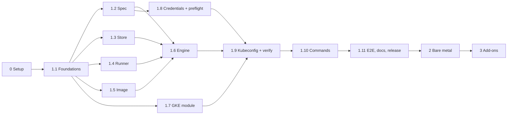

# Implementation plan

This plan turns [design 0001](design/0001-architecture.md) into phases and pull-request-sized milestones. Each milestone ends with merged, tested code; nothing is left half-wired.

Estimates assume one developer working full time and are rough. Two developers can run the milestones marked **∥** in parallel.

## Overview

| Phase | Outcome | Rough effort |
|---|---|---|
| 0. Project setup | Public repo, settings, decisions made | 1–2 days |
| 1. GKE (v0.1.0) | Create, list, describe, and delete GKE clusters safely on Windows, macOS, Linux | 5–6 weeks |
| 2. Bare metal (v0.2.0) | Clusters on user-provided machines | 3–4 weeks |
| 3. Add-ons and distribution (v0.3.0) | `install <addon>`, Krew index, docs site | 3 weeks |
| 4. Later | EKS and AKS platforms, Cluster API manifests as input, upgrade, scale, remote state, scheduled cleanup | Ongoing |

AWS is out of scope until phase 4. Phase 1 builds the platform, runner, and store interfaces so EKS can be added later as a self-contained package without changing the core (see "Interfaces and extension points" in design 0001).

---

## Phase 0: project setup

| Task | Owner |
|---|---|
| Commit and push the bootstrap to `tuggy-dev/kubectl-tuggy` | Claude, after approval |
| Repo settings: protect `main` (PR + passing CI required), squash merges, enable private vulnerability reporting, install the DCO app | Maintainer |
| Labels: `kind/bug`, `kind/feature`, `area/gke`, `area/metal`, `area/cli`, `good first issue`, `needs-triage` | Claude |
| Email routing for `conduct@tuggy.dev` (Cloudflare Email Routing) | Maintainer |
| Decide the 5 open questions in design 0001 (bare metal can wait until phase 2) | Maintainer |
| Create one GitHub issue per milestone below, grouped in a "v0.1.0" milestone | Claude |

**Prerequisites for later phases (start now, they take time):**

- A sandbox GCP project with billing and a budget alert, for end-to-end tests.
- Workload Identity Federation from GitHub Actions to that project, so CI needs no stored keys.

---

## Phase 1: GKE, v0.1.0

### 1.1 Foundations

- `go.mod` (`github.com/tuggy-dev/kubectl-tuggy`), `cmd/kubectl-tuggy/main.go`, cobra root command, `version` command with build info.
- Exit codes from the design, with unknown commands, flags, and arguments mapped to exit code 2.
- `Makefile`: `build`, `test`, `lint`, `fmt`, `install` (copies to a PATH directory).
- `.golangci.yml`, `.editorconfig`.
- CI workflow: lint, unit tests, and build on `ubuntu`, `macos`, and `windows` runners. DCO check.

**Done when:** `kubectl tuggy version` works after `make install` on all three OSes in CI.

### 1.2 Cluster spec ∥

- `internal/input/specfile/v1alpha1`: the spec file format only. `Cluster`, `NodePool`, raw `platformConfig`, defaults, common validation (name rules, TTL parsing). No platform-specific types here; platforms translate this format into their own typed variables.
- Load from YAML (`-f`) with strict decoding (unknown fields are errors). Flags map onto the same type.

**Done when:** table-driven tests cover defaults and every validation rule.

### 1.3 Local store and platform interface

- `internal/store`: `Store` interface, and a local implementation with the `~/.tuggy` layout, `record.yaml` read/write, status transitions (Creating, Ready, Failed, Deleting) enforced in one place.
- Per-cluster lock file (cross-platform, for example `gofrs/flock`), stale-lock detection.
- Owner-only permissions on Linux and macOS; documented behaviour on Windows (user profile ACLs).

- The record holds only tuggy's own facts (name, platform, status, created time, TTL, tuggy version, outputs); everything the user asked for stays in the platform's own files.
- `internal/platform`: the `Platform` interface (`FromV1Alpha1`, `Preflight`, `Create`, `Delete`, `Describe`, `Kubeconfig`, `ListRemote`), shared types (`Plan`, `CheckResult`, `ClusterInfo`, options), the registry (`Register`, `Get`, `Names`), and the optional `FlagBinder` interface. `internal/platforms` with blank imports. This comes after the spec and store because the interface uses both types.
- A fake platform used only in tests, to prove the CLI works through the interface alone.

**Done when:** tests cover every allowed and forbidden transition, two processes can't lock the same cluster, and a test registers the fake platform and looks it up by name.

### 1.4 Container runner ∥

- `internal/runner`: interface `Run(ctx, Spec) (exitCode, error)` with mounts, env, working dir, labels, stdout/stderr writers.
- Docker implementation: API version negotiation, image pull with fallback to local image, `Tty: false` + `stdcopy`, `ContainerWait` exit code, Ctrl-C handling (SIGINT, 60s grace, kill), UID/GID on Linux, absolute and Windows path handling, cleanup by label.
- Fake runner for other packages' tests.

**Done when:** integration tests on the Linux CI runner start a small image and verify exit codes, stream separation, and cancellation. Unit tests cover path conversion for Windows.

### 1.5 tofu image ∥

- `images/tofu/Dockerfile` based on the official OpenTofu image, pinned version.
- Workflow to build multi-arch (amd64, arm64) and push to `ghcr.io/tuggy-dev/tofu` on changes and on release.
- Image reference and digest embedded in the binary at build time.

**Done when:** the image is published and the binary prints its pinned image in `version`.

### 1.6 OpenTofu engine

- `internal/engine/tofu`: write the embedded module and `terraform.tfvars.json` into the workspace; run `init`, `plan -out`, `apply <plan>`, `plan -destroy`, `output -json` through the runner.
- Parse OpenTofu `-json` events into progress updates (resource started, completed, failed, elapsed time) and a plan summary.
- Full output to `logs/<timestamp>-<action>.log`.

**Done when:** tests with the fake runner replay recorded OpenTofu JSON for success, failure, and cancellation, and the engine reports each correctly.

### 1.7 GKE module ∥

- `internal/platform/gke/module`: cluster with default pool removed, node pools from a list, Workload Identity, release channel, labels (`managed-by`, `tuggy-cluster`, `tuggy-expires-at`), optional impersonation. Outputs: name, location, project, endpoint, CA, version.
- Embedded with `go:embed` from inside the gke package, so the module ships with its platform.
- CI: `tofu fmt -check`, `tofu validate`, and `tofu test` with mocked OpenTofu providers.

**Done when:** module tests pass in CI and a manual apply in the sandbox project works.

### 1.8 GKE platform: config, variables, credentials, preflight

- `internal/platform/gke`: config type decoded from `platformConfig`, validation, platform-specific flags (`--project`, `--location`) via `FlagBinder`.
- `gke.Variables`, a typed struct mirroring the module's `variables.tf`, and `FromV1Alpha1` translating the spec into it. A contract test checks the struct and the module's declared variables match exactly.
- `Describe`, reading location and node pools back from the cluster's variables file.
- Google ADC discovery (env var, gcloud file on each OS), returning the single file to mount and the account email.
- GKE preflight using Google's Go SDK: credentials valid, required permissions present (`testIamPermissions` on the project), Kubernetes Engine API enabled. Each failure has a fix hint.
- Shared checks: container runtime reachable, image available or pullable, `gke-gcloud-auth-plugin` on PATH.

**Done when:** each check has unit tests with fakes, and `doctor` output was reviewed for clarity.

### 1.9 Kubeconfig and readiness

- GKE platform builds its kubeconfig entry from outputs with the exec auth plugin.
- `internal/kubeconfig`: merge into the user's kubeconfig, switch context, remove only tuggy's entries on delete.
- Readiness check: `/readyz` and `/version` with retries up to 2 minutes.

**Done when:** merge and removal are tested against fixture kubeconfigs, including ones with many existing contexts.

### 1.10 Commands

- `create cluster`, `delete cluster`, `delete clusters --expired`, `get clusters`, `describe cluster`, `get kubeconfig`, `doctor`.
- Confirmation prompts, `--yes`, refusal without a terminal, `--dry-run`, `-v`, `-o table|json|yaml`.
- Progress display from engine events. Exit codes from the design.
- TTL: stored on create, shown in `get`, expiry warning on every command.
- Resume: `create` on a `Failed` record re-applies.
- `~/.tuggy/config.yaml` for defaults (project, location, TTL, image).

**Done when:** command tests run against fake platform and runner, covering confirmation, `--yes`, resume, and every exit code. Each of the 13 demo defects in the design has a test proving it is fixed.

### 1.11 End-to-end, docs, release

- E2E workflow (manual and nightly): create a small GKE cluster in the sandbox, check `get`/`describe`/`kubectl get nodes`, delete it, and always delete in a cleanup step.
- Docs: install, quickstart, GKE guide (permissions to grant, impersonation), troubleshooting, command reference generated from cobra.
- GoReleaser for 6 OS/arch targets, checksums, SBOM, cosign signing, generated Krew manifest attached to the release.
- Manual test pass on Windows, macOS, and Linux with Docker Desktop, plus Podman on Linux.

**v0.1.0 is done when:** E2E is green, the manual pass on all three OSes succeeds, and a new user can go from install to a working cluster following only the quickstart.

---

## Phase 2: bare metal, v0.2.0

| Milestone | Scope |
|---|---|
| 2.1 Decision record | Choose k3s, kubeadm, or Talos (design 0002). Define the inventory format (hosts, SSH user, key, roles). |
| 2.2 Backend | SSH executor (or Talos API client), idempotent install steps, join tokens, HA control plane option. |
| 2.3 Platform | Implements the same `Platform` interface: create, delete (uninstall and clean), kubeconfig from the control plane. |
| 2.4 Tests | E2E against throwaway VMs (for example cloud VMs created by the test, then deleted). Docs. |

---

## Phase 3: add-ons and distribution, v0.3.0

| Milestone | Scope |
|---|---|
| 3.1 Design note | Add-on definition format (chart, version, default values, checks), where values overrides come from, upgrade and uninstall rules. |
| 3.2 `install`, `uninstall`, `list addons` | Helm Go SDK on the host. First add-ons: ingress-nginx, cert-manager, PostgreSQL, metrics-server. |
| 3.3 Krew | Submit to the Krew index; automate manifest updates on release. |
| 3.4 Docs site | tuggy.dev on Cloudflare Pages or GitHub Pages: quickstart, guides, reference. |

---

## Phase 4: later

- EKS platform: `internal/platform/eks` with its module and typed variables (dedicated VPC, IAM roles, managed node groups), AWS credential discovery, preflight, `aws eks get-token` kubeconfig, E2E in an AWS sandbox account.
- AKS platform, the same way.
- Cluster API manifests as an input format: a `FromCAPI` translation per platform (see open question 6 in design 0001).
- `upgrade cluster` (Kubernetes version and tuggy module version).
- `scale nodepool`.
- Remote state (GCS, S3) for teams sharing clusters.
- Optional scheduled TTL cleanup running in the user's cloud.
- Local kind platform.

## Risks

| Risk | Mitigation |
|---|---|
| Real-cloud tests are slow and cost money | Fake runner and recorded OpenTofu output for most tests; E2E only nightly or manual, smallest machine types, always clean up, budget alert on the sandbox |
| Docker behaves differently on Windows, macOS, and Podman | Runner integration tests plus a manual test matrix before every release |
| Users without the needed IAM permissions | Preflight names the missing permission and the role that grants it |
| Changing a module breaks existing clusters | Each cluster keeps its own module copy; upgrades are an explicit later command |
| Leaked or broad credentials | Mount only the single credentials file, read-only; owner-only workspace permissions; no credentials in logs |
